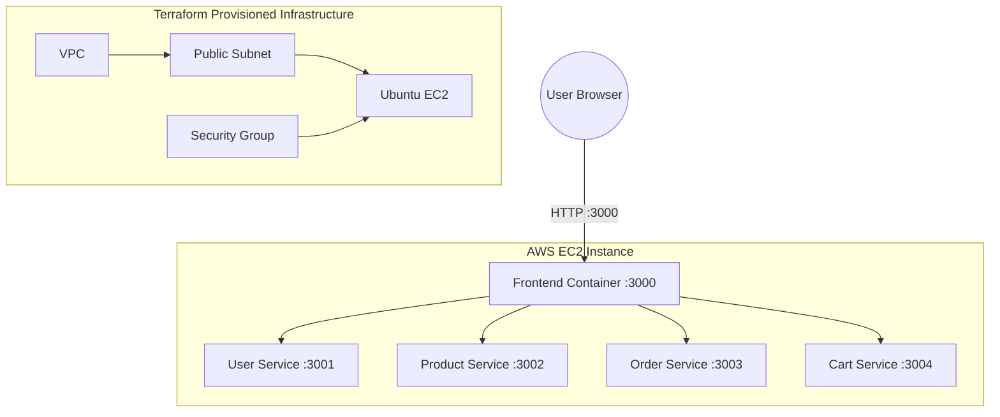
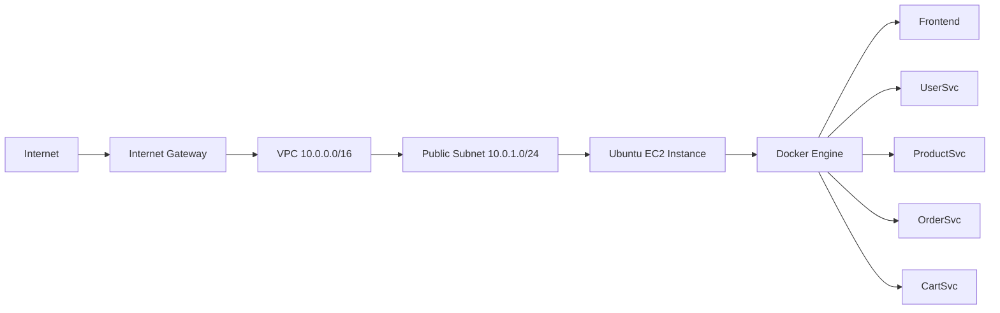
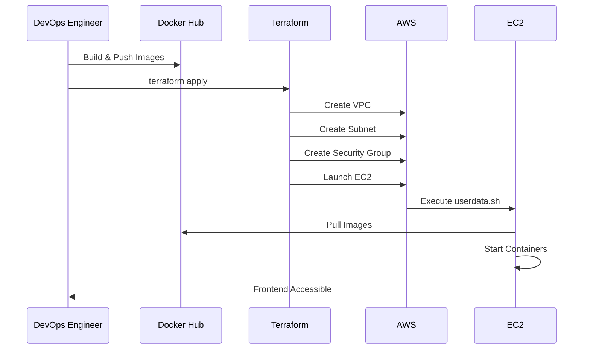

# E-Commerce Store Microservices Deployment using Docker & Terraform on AWS

## Project Overview

This project demonstrates the deployment of a **Node.js Microservices-based E-Commerce Application** using **Docker**, **Terraform**, and **AWS EC2**.

The application consists of:

| Service         | Description                        |
| --------------- | ---------------------------------- |
| Frontend        | User-facing web application        |
| User Service    | User authentication and management |
| Product Service | Product catalog management         |
| Order Service   | Order processing                   |
| Cart Service    | Shopping cart management           |

All services are containerized using Docker, published to Docker Hub, and automatically deployed to AWS infrastructure provisioned with Terraform.

---

# Solution Architecture



---

# 🛠️ Technology Stack

| Category         | Technology                    |
| ---------------- | ----------------------------- |
| Cloud            | AWS                           |
| IaC              | Terraform                     |
| Containerization | Docker                        |
| Runtime          | Node.js                       |
| Registry         | Docker Hub                    |
| Compute          | EC2                           |
| Networking       | VPC, Subnet, Internet Gateway |
| Security         | Security Groups               |

---

# Repository Structure

```text
E-CommerceStore-skilltest3
│
├── backend
│   ├── user-service
│   ├── product-service
│   ├── order-service
│   └── cart-service
│
├── frontend
│
├── terraform
│   ├── provider.tf
│   ├── variables.tf
│   ├── terraform.tfvars
│   ├── main.tf
│   ├── outputs.tf
│   └── userdata.sh
│
└── README.md
```

---

# Project Objectives

* Containerize all microservices
* Push Docker images to Docker Hub
* Provision AWS infrastructure using Terraform
* Deploy all services automatically
* Expose frontend publicly
* Ensure reproducibility using Infrastructure as Code

---

# 🐳 Step 1 – Dockerize Services

Each service contains its own Dockerfile.

Example:

```dockerfile
FROM node:18-alpine

WORKDIR /app

COPY package*.json ./

RUN npm install

COPY . .

EXPOSE 3001

CMD ["npm","start"]
```

Dockerfiles were created for:

* Frontend
* User Service
* Product Service
* Order Service
* Cart Service

---

# 🔨 Step 2 – Build Docker Images

### User Service

```bash
docker build -t user-service:v1 ./backend/user-service
```

### Product Service

```bash
docker build -t product-service:v1 ./backend/product-service
```

### Order Service

```bash
docker build -t order-service:v1 ./backend/order-service
```

### Cart Service

```bash
docker build -t cart-service:v1 ./backend/cart-service
```

### Frontend

```bash
docker build -t frontend-service:v1 ./frontend
```

---

# 📦 Step 3 – Push Images to Docker Hub

Authenticate:

```bash
docker login
```

Tag Images:

```bash
docker tag user-service:v1 saim2026/e-commercestore:user-service-v1

docker tag product-service:v1 saim2026/e-commercestore:product-service-v1

docker tag order-service:v1 saim2026/e-commercestore:order-service-v1

docker tag cart-service:v1 saim2026/e-commercestore:cart-service-v1

docker tag frontend-service:v1 saim2026/e-commercestore:frontend-service-v1
```

Push Images:

```bash
docker push saim2026/e-commercestore:user-service-v1

docker push saim2026/e-commercestore:product-service-v1

docker push saim2026/e-commercestore:order-service-v1

docker push saim2026/e-commercestore:cart-service-v1

docker push saim2026/e-commercestore:frontend-service-v1
```

---

# ☁️ Step 4 – Provision AWS Infrastructure

Terraform provisions:

* VPC
* Public Subnet
* Internet Gateway
* Route Table
* Security Group
* Ubuntu EC2 Instance

---

## Network Topology



---

# 🔐 Security Configuration

The Security Group allows:

| Port | Purpose         |
| ---- | --------------- |
| 22   | SSH             |
| 3000 | Frontend        |
| 3001 | User Service    |
| 3002 | Product Service |
| 3003 | Order Service   |
| 3004 | Cart Service    |

---

# ⚙️ Step 5 – Automatic Deployment

Terraform uses:

```bash
userdata.sh
```

to:

1. Install Docker
2. Pull images from Docker Hub
3. Start all containers
4. Expose service ports

Example:

```bash
docker pull saim2026/e-commercestore:frontend-service-v1

docker run -d \
--name frontend-service \
-p 3000:3000 \
saim2026/e-commercestore:frontend-service-v1
```

---

# 🚀 Step 6 – Deploy Infrastructure

Initialize Terraform:

```bash
terraform init
```

Validate:

```bash
terraform validate
```

Format:

```bash
terraform fmt
```

Preview:

```bash
terraform plan
```

Deploy:

```bash
terraform apply -auto-approve
```

---

# 📤 Terraform Outputs

After deployment:

```bash
terraform output
```

Example:

```text
public_ip = 54.xx.xx.xx

frontend_url = http://54.xx.xx.xx:3000
```

---

# 🧪 Step 7 – Verification

### Verify Frontend

Open:

```text
http://PUBLIC_IP:3000
```

Expected:

```text
Frontend is Live
```

---

### Verify Containers

SSH:

```bash
ssh -i key.pem ubuntu@PUBLIC_IP
```

Check running containers:

```bash
docker ps
```

Expected:

```text
frontend-service
user-service
product-service
order-service
cart-service
```

---

### Verify Backend APIs

```bash
curl localhost:3001
curl localhost:3002
curl localhost:3003
curl localhost:3004
```

Expected responses:

```text
User Service Running

Product Service Running

Order Service Running

Cart Service Running
```

---

# 📊 Deployment Workflow



---

# ✅ Assignment Requirements Mapping

| Requirement                       | Status |
| --------------------------------- | ------ |
| Dockerize 5 Services              | ✅      |
| Push Images to Docker Hub         | ✅      |
| Terraform Infrastructure          | ✅      |
| VPC Provisioning                  | ✅      |
| Public Subnet                     | ✅      |
| Security Groups                   | ✅      |
| EC2 Deployment                    | ✅      |
| Docker Installation via User Data | ✅      |
| Automatic Container Startup       | ✅      |
| Frontend Public Access            | ✅      |
| Terraform Outputs                 | ✅      |
| Reproducible Deployment           | ✅      |

---

# 📸 Sample Output

```text
terraform output

public_ip = 54.210.xxx.xxx

frontend_url = http://54.210.xxx.xxx:3000
```

Frontend:

```html
Frontend is Live
```

---

# 🏆 Conclusion

This project successfully demonstrates an end-to-end DevOps workflow by combining:

* Docker Containerization
* AWS Infrastructure Provisioning
* Terraform Automation
* Microservices Deployment
* Infrastructure as Code (IaC)

The solution is fully reproducible, scalable, and follows modern DevOps deployment practices.

----

## Author
**Saima Usman** \
Jr. DevOps & Cloud Engineer 

